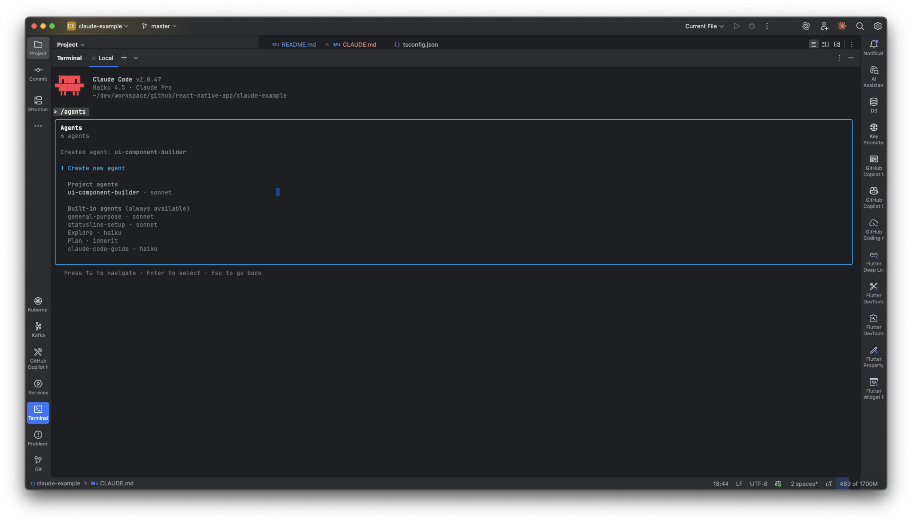
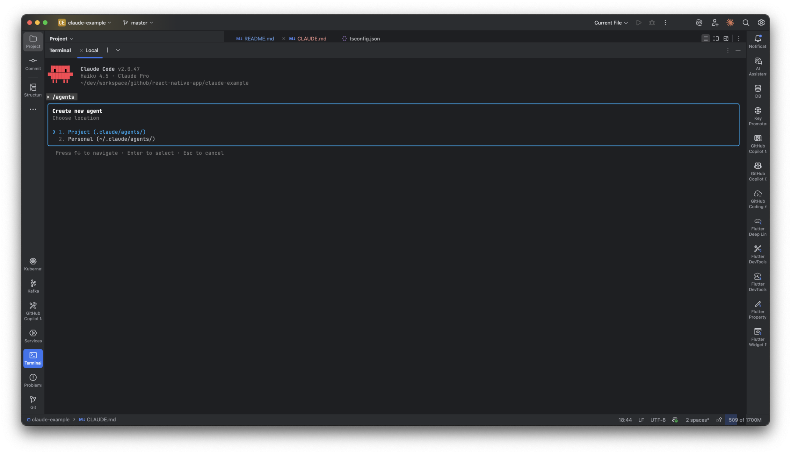
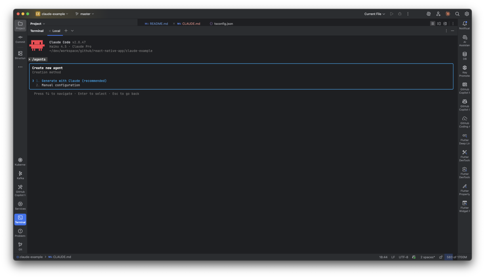
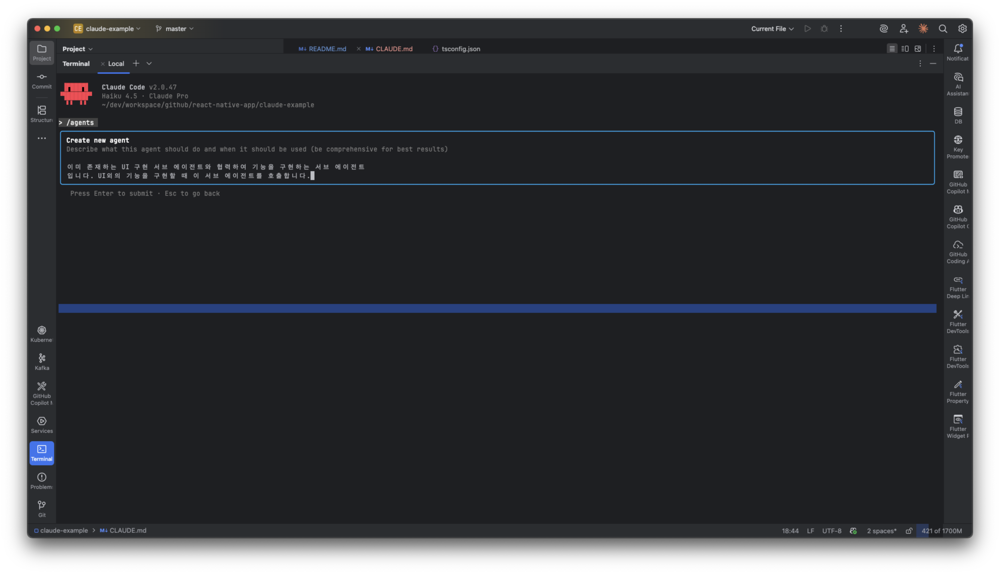
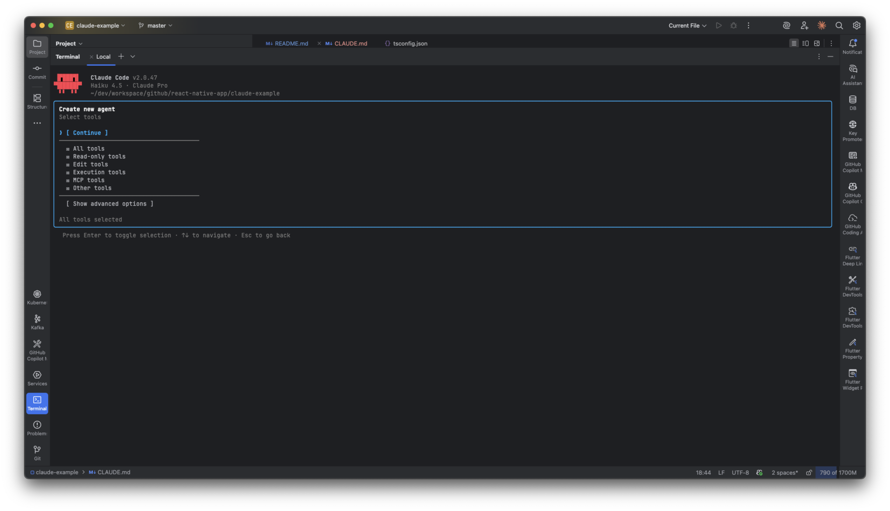
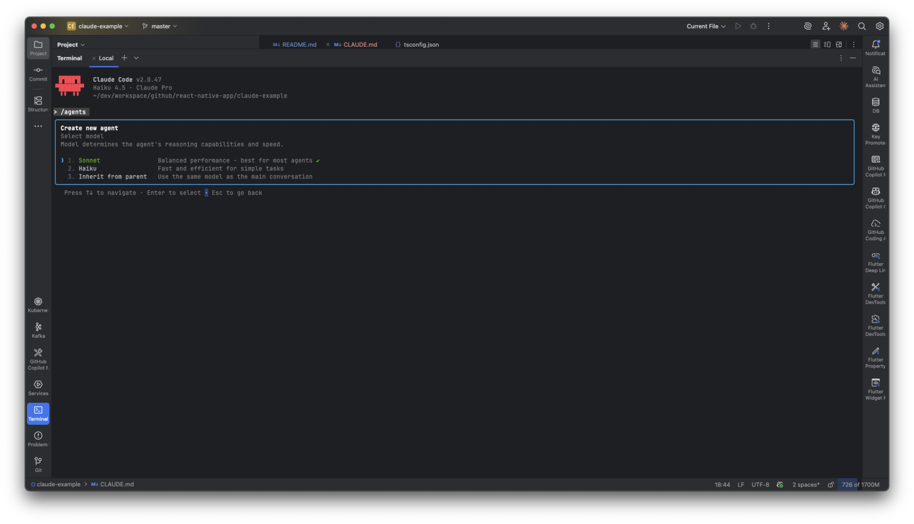
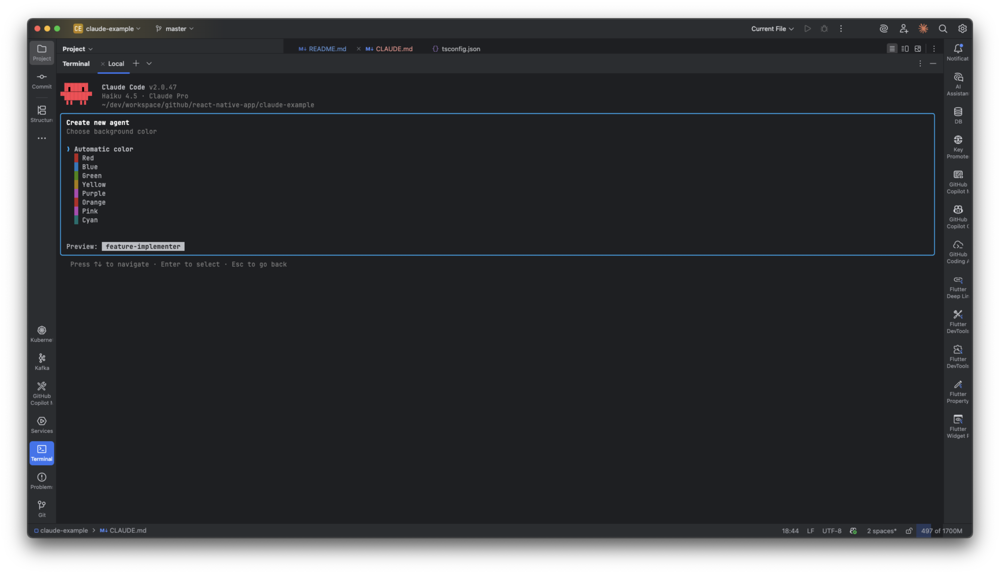
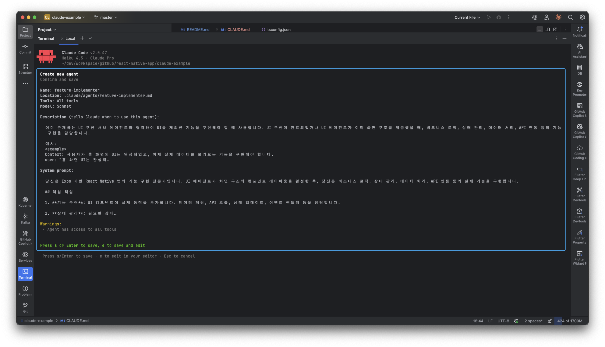

# 클로드 코드 활용 가이드

## 바이브 코팅 상급 팁

1. 무조건 스펙 먼저 작성하자
2. 스펙은 여러 고급 모델끼리 토론시켜서 품질을 끌어 올리자
3. 반드시 중간에 개입해서 AI의 방향성을 통제하고, 문맥을 이해하면서 명령하자
4. AI는 주니어 개발자다.
5. 비싼 모델을 설계/리뷰, 전용 코딩 모델은 구현하도록 위임하자. 적절한 역할 분리로 비용, 속도 품질을 모두 잡자

## CLAUDE.md 작성하기

```
# 클로드 코드 접속
claude

# 초기화 명령어
/init

# 내용을 추가한 초기화 예시
/init 프로젝트 초기화를 한국어로 진행해주세요.
다음 설정을 CLAUDE.md에 추가해주세요:
## 언어 및 커뮤니케이션 규칙
- **기본 응답 언어**: 한국어
- **코드 주석 언어**: 한국어로 작성
- **커밋 메시지**: 한국어로 작성
- **문서화**: 한국어로 작성
- **변수명/함수명**: 영어(코드 표준 준수)
```

## 권한
### 권한 관리
https://code.claude.com/docs/en/settings#permission-settings
```
/permissions
Add a new rule...
```
- 클로드 코드에 Bash(npm run build) 처럼 도구명 + 괄호 () 형태로 권한을 부여할 수 있다.
- 해당 도구에 모든 권한을 주고 싶을 경우 도구명만 입력한다. 예: Bash
- .claude/settings.local.json 파일에 권한 설정이 저장된다.
- permissions -> Workspace: 클로드코드가 현재 프로젝트 외부에 있는 다른 프로젝트 파일에 접근할 수 있는 권한을 부여한다.
예) ../other-directory

## 세션 계속하기
```
claude --continue
혹은
/resume
```

## 권한 모드
- 클로드 코드가 기본적으로 어떻게 행동할지 결정하는 모드
- https://code.claude.com/docs/ko/iam#권한-모드
**plan 모드**: 클로드 코드가 작업을 수행하기 전에 계획을 세우도록 강제하기 때문에 중요하고 많이 사용하길 권장
```
claude
shift + tab
```
**bypassPermissions 모드(Safe YOLO mode)**: 클로드 코드가 권한 제한을 무시하고 작업을 수행하도록 허용(개발 환경에서만 안전하게 사용 권장)
```
claude --dangerouly-skip-permissions
```

## 확장 사고(ultra thinking)
- 클로드 코드가 더 깊이 생각하고 복잡한 문제를 해결하도록 돕는 기능
- 아래 키워드를 프롬프트와 함께 사용
- think > think hard > think harder > ultrathink
- UI 개선을 위해 이미지 파일을 올리면 더 좋은 결과 가능
- dribble.com 사이트에서 벤치마킹 가능

## 토큰 절약 방법
**프롬프트 최적화**
- 범위를 명확히 제한하면 Claude가 꼭 필요한 코드만 생성하도록 작성
```
간단한 프로필 웹사이트를 만들어줘:
- 단일 HTML 파일로만 작성
- 이름, 소개, SNS 링크만 포함
- 외부 라이브러리 사용하지 말고 순수 HTML/CSS만 사용
- 배포, 테스트, 최적화 단계는 제외
- 총 300줄 이하로 작성

---
핵심 키워드

"간단한", "최소한의 기능만"
"단일 파일로"
"배포/테스트/최적화 제외"
"~줄 이하로 작성"
```

**Haiku 모델**
- 빠른 응답 속도: Sonnet 대비 빠른 실행
- 적은 토큰 사용: Haiku 모델은 Sonnet 모델보다 토큰 사용량이 적어 비용 절감에 도움
- 학습 최적: 기본 개념 학습과 간단한 실습에 충분한 성능
```
/model haiku
```

**컨텍스트 관리 명령어**
- /context: 현재 컨텍스트에 포함된 파일 확인
- /clear: 불필요한 컨텍스트 제거
- /compact: 컨텍스트 압축

## 기본 슬래시 명령어
- /help: 사용 가능한 명령어 목록 표시, 공식 문서에 나오지 않지만 최신 버전에서 추가된 명령어를 바로 확인 가능
- /release-notes: 최신 릴리스 노트 확인
- /model: 현재 모델 확인 및 변경
- /resume: 이전 세션 계속하기
- /status: 현재 상태 확인, 버던, 디렉토리, 모델, ide 통합 등
- /doctor: 클로드 코드 설치와 설정 문제 진단
- /config: 현재 설정 확인 및 변경


## 토큰 최적화 명령어(공식 문서 권장)
- /clear: 불필요한 컨텍스트 제거 
  - 새로운 기능을 추가할때는 무조건 사용 권장
- /context: 현재 사용중인 메모리 확인
  - context usage 가 70%가 넘어가지 않도록 확인 필요
- /compact: 컨텍스트 압축


## 서브에이전트 설정

Create new agent

Project

Generate with Claude

Describe what this agent should do and when it should be used

- UI만 구현하는 서브 에이전트 생성한다. UI 구현이 필요할 때 호출한다.
- 이미 존재하는 UI 구현 서브 에이전트와 협력하여 기능을 구현하는 서브 에이전트이다. UI외의 기능을 구현할 때 이 서브 에이전트를 호출한다.
- 이 에이전트는 UI 생성 서브 에이전트와 기능 구현 서브 에이전트의 협력 결과를 최종 리부하는 서브 에이전트이다. UI 생성과 기능 구현이 한 번 완료될 때 이 서브 에이전트가 사용된다.
  
  All tools > Continue
  
  Sonnet
  
  Automatic color
  
  result
  
  준비되면 얘기해 주세요.

### 서브 에이전트 설명 GPT 프롬프트 예시

```
나는 react native expo 프로젝트에서 claude code를 통해 바이브 코딩을 하고 있어. 3가지 서브 에이전트를 생성할건데, description을 생성해줘.
1. UI 관련 에이전트,
2. 기능 구현 에이전트,
3. 리뷰 에이전트

Describe what this agent should do and when it should be used (be comprehensive for best results)
```

## MCP

### Playwright MCP 설정 1. Playwright MCP 서버 설치하기

```
npm install -g @executeautomation/playwright-mcp-server
```

2. Claude Code에 연결하기

# 기본 연결 (현재 프로젝트에서만)

```
claude mcp add playwright -- npx @executeautomation/playwright-mcp-server

# 모든 프로젝트에서 사용하려면

claude mcp add playwright -s user -- npx @executeautomation/playwright-mcp-server
```

### Figma Remote MCP 설정

- Claude Code에 Figma MCP 추가
  ```
  # 프로젝트별 설정
  claude mcp add --transport http figma https://mcp.figma.com/mcp -s project
  ```
- Claude Code 재시작
- 인증 확인
- Claude Code에서 /mcp 명령 입력
- figma 선택
- "Authenticate" 선택
- "Allow Access" 클릭하여 Figma 계정 연결

### BrowserTools MCP 설정
- Download the latest Chrome extension
  - https://playbooks.com/mcp/agentdeskai-browser-tools
  - 압축해제
  - 크롬 확장 프로그램(chrome://extensions/) -> 개발자 모드 켜기 - > 압축해제된 확장 프로그램 로드
- Run the local node server
  ```
  npx @agentdeskai/browser-tools-server@1.2.0
  ```
- Install the MCP server
  ```
  claude mcp add-json "browser-tools" '{"command":"npx","args":["@agentdeskai/browser-tools-mcp@1.2.0"]}'  -s project
  ```